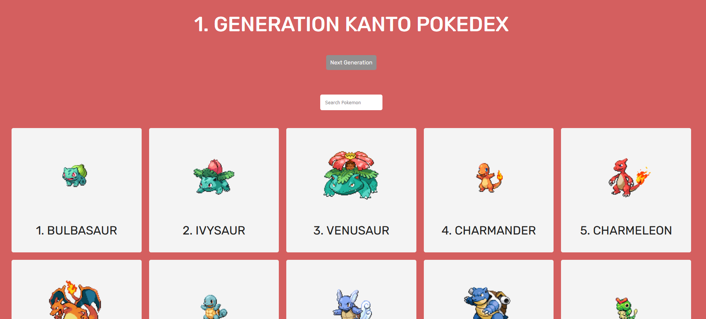
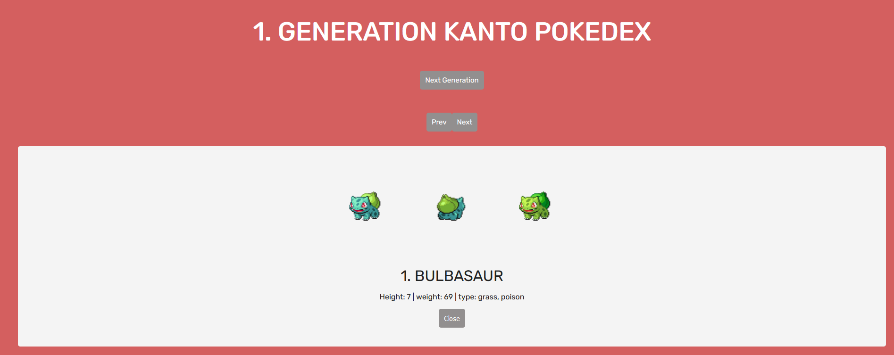
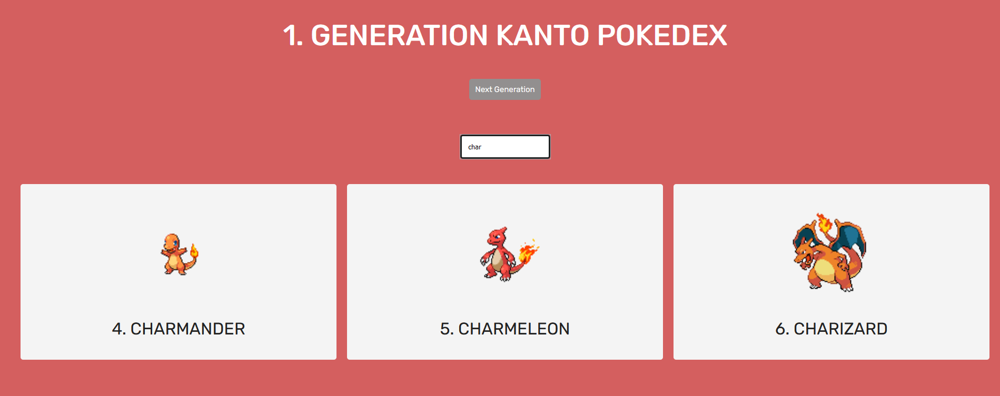

Aufgabe:
Eine Webseite soll Daten von einer API empfangen und diese Daten anschließend ausgegben werden.

1. Baue ein einfaches Frontend mit einem Suchfeld und einem HTML Tag Element zum dastellen von den Daten, z.B. ul
2. Beschäftige dich mit der API und ihren speziellen Rückgaben! Benutze Postman um eine Struktur zu erkennen!
API: https://pokeapi.co/
3. Schreibe eine fetch für die Pokemon
4. Erstelle aus den Rückgaben ein eignes Objekt mit den benötigten Werten und das Objekt soll auch einen Link zu dem Bild haben.
Bild Beispiel: https://raw.githubusercontent.com/PokeAPI/sprites/master/sprites/pokemon/1.png
5. Jedes Pokemon soll eine einzelne Kachel in der ul sein mit dem Bild, einer Nummber und dem Namen. Dabei soll das Bild klickbar sein
6. Bei der Auswahl eines Pokemons sollen die genauen Daten des Pokemons über die API geladen werden und entsprechend ausgegeben werden
7. Achte genau auf die Rückgaben der einzelnen Pokemon und baue dir dein HTML richtig zusammen
8. Die Details sollen auch wieder schließbar sein
9. Ein Suchfeld soll auf einen eventListener hören und anschließend die richtigen Pokemon dastellen
 
BONUS!!!:
 
1. Die Pokemon der jeweiligen Generationen können geladen werden 
2. In der Detail Ansicht kann zum vorherigen und zum nächsten Pokemon gewechselt werden 
3. In der Detail Ansicht werden mehr Informationen dargestellt 
4. Fehlertoleranz!!! Was ist wenn die API versagt? Suchfeld Error Handling? Was passiert wenn PokemonId 0 geladen wird? Was ist wenn die PokemonId zu groß oder klein ist?

Bilder:

